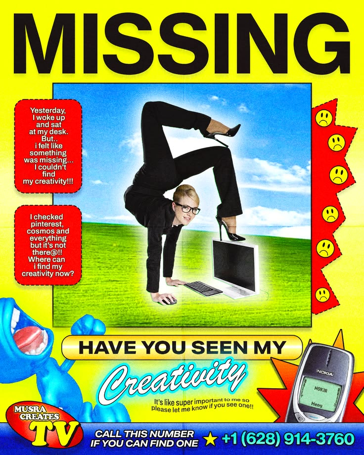
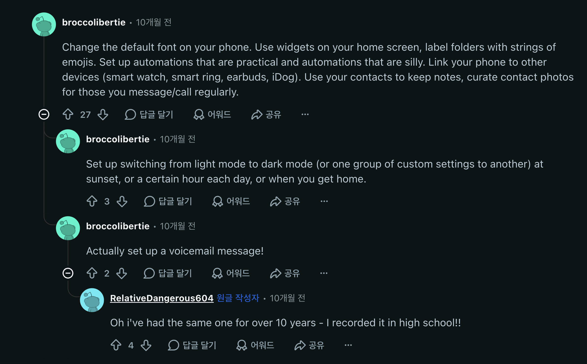
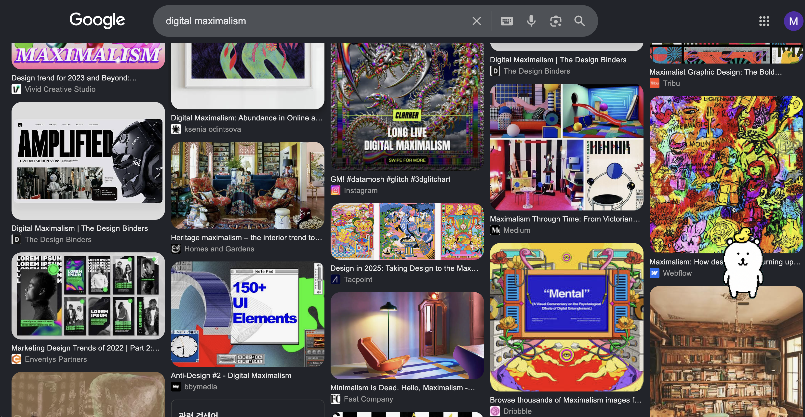
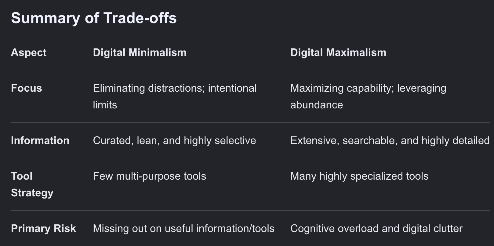
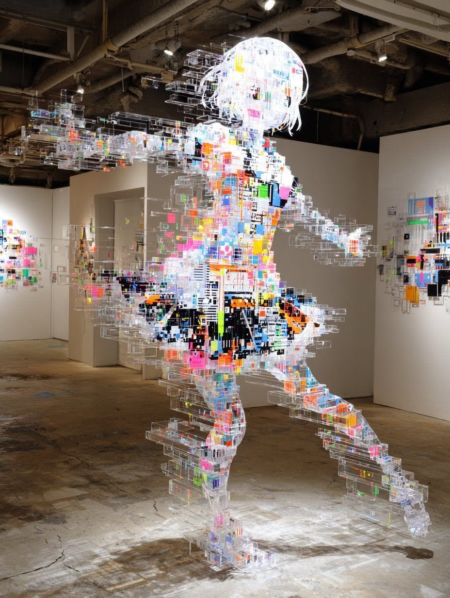

When I started my journey to become an AI engineer, one of the first things I wanted to "fix" was my Github blog.

Not my coding skills or anything. My Github blog.

I wanted it to look pretty, arranged, organized, and somehow very me. I’ve always had this weird urge to set up everything to my taste, like I’m Tony Stark opening his laptop and everything has to look cool before I can actually do anything.

So I borrowed a theme from someone, who I assume is a software engineer at one of the big tech companies, and started tweaking little things inside it to mix in a bit of my identity.

And while doing that, I found a post under the blog menu.

The title was "Digital Minimalism."

I had already finished my part for the morning and was basically chilling at work, so I just read it.

And what it was saying was that there is this trend of trying to be digitally minimal.

Like unsubscribing from emails.

Deleting apps you never use.

Turning off notifications.

Unfollowing people on social media.

Getting rid of things you don’t really need.

And the funny thing is...

I basically do the opposite.

Not because I’m intentionally trying to be anti-minimalist or anything.

I just like having things.

A lot of things.

So I started wondering if there’s actually a name for this.

---

## 1. So, what does it mean "digial maximalism"?

i have a serious symtom that i cannot do anything without searching first.
so guest what... i searched what digianl maximalism means. and here i found a reddit post which is quite funny.

i kidna doing these all to my phone and laptop.
its like you change everytihng that was set up to be default already and then you cant help but changing it.. cause it looks so boring and ugly!!!

when you search "digital maximalism" on google, you can also feel it through the visuals... i really love these king of designs that clutter everything inside a box!!!!

## 2. What is the advantage to be digially maximal?

So since were living in a world that preferes to be minimal, which many people like me never give a damn about, you kinda wonder what is the positive side of being digitally maximal.
to be honest it looks sometimes so dirty, dizzy and its giving ADHD vibe.

So....

guess what i did to fill up this part?
i searched on google what is the advantage of digital maximalism. and our kind godly Gemini gave me beatifully arranged table comparing digital minimulism and maximalism.

i hope that you get it for now.

## 3. what i actually wanna say is...

I want this world to be accepting that its not adhd..but giving *creativity* 

I think what I actually wanna say is that I don’t really want everything to become minimal.

I know minimalism is supposed to make things easier, cleaner, and less distracting.

And yes, I get it.

I also hate having 12 useless apps sending me notifications.

I also unsubscribe from emails.

I also delete things I don’t need.

So technically, maybe I’m not even a digital maximalist in the proper sense.

I just like visual maximalism.

I like opening something and seeing personality in it.

I like when things look a little busy.

I like when there are small details that probably weren’t necessary at all, but someone added them anyway because they wanted to.

And I wish people would stop looking at every slightly chaotic thing and immediately saying it’s giving ADHD.

Sometimes I just wanted another widget.

Sometimes I wanted to change the font.

Sometimes I wanted stars moving in the background of my Github page even though literally nobody asked for that.

And maybe that’s the whole point.

I don’t want my digital space to only be efficient.

I want it to feel like mine.

Even if that means spending three hours customizing the blog instead of actually studying AI.