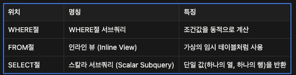
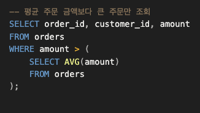
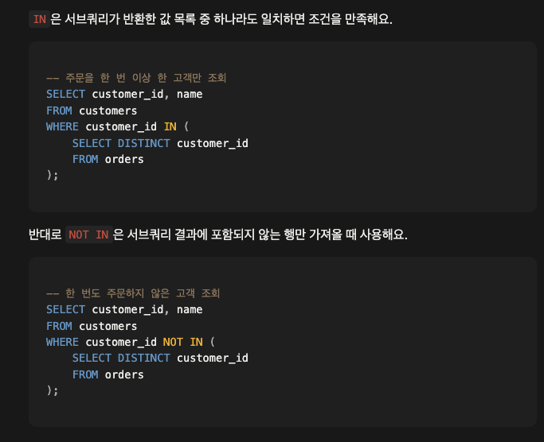
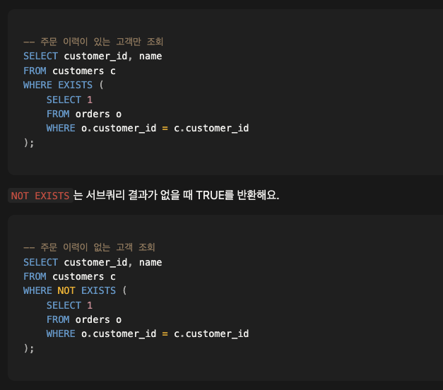
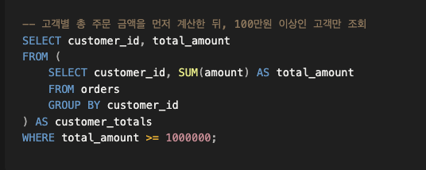
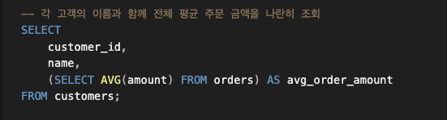
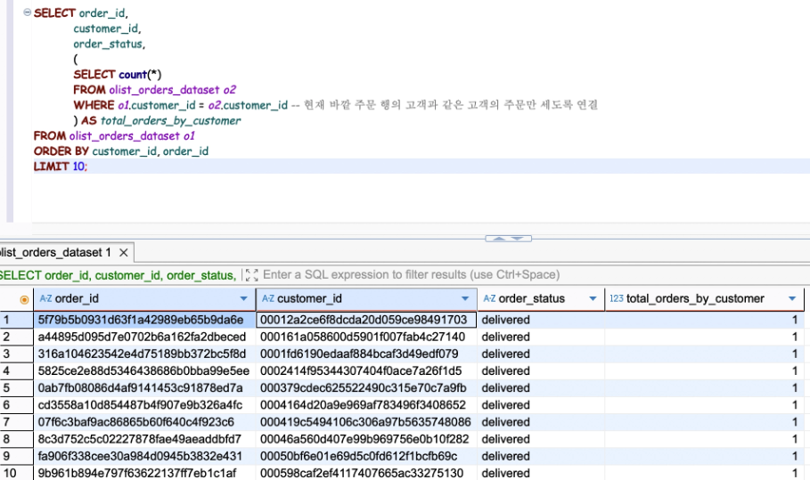

### 서브쿼리
- 조건을 계산한 뒤 적용
- outer query보다 먼저 실행됨
- PostgreSQL - EXPLAIN ANALYZE 사용해서 실행순서 확인 가능
---
[종류]

---
Where Subquery

---
IN/NOT in Subquery

- NOT IN 사용시 NULL 있으면 전체 빈 결과 반환
---
EXISTS/NOT EXISTS in Subquery

- 값 하나라도 일치하면 TRUE 반환 = outer query 행 반환
- 아무것도 일치하지 않으면 반환 x
- SELECT 1은 관례적 표현
- 데이터가 존재하는지만 여부 판단할 때 사용
- 데이터가 많을 때 IN/NOT보다 효과적
---

From Inline View

- 임시 테이블이므로 alias 꼭 붙여서 나중에 참조 가능하도록 함
- Inline View에서 만들어진 집계함수, 컬럼은 외부에서 참조가능

---
Select Scalar Subquery

- select에 위치한 서브쿼리
- Scalar: 단일 값
- 스칼라 서브쿼리는 반드시 하나의 행/하나의 열만 반환
- **상관 서브쿼리**: 외부 쿼리의 행 정보를 스칼라 서브쿼리 안에서 참조
- 예)
- 