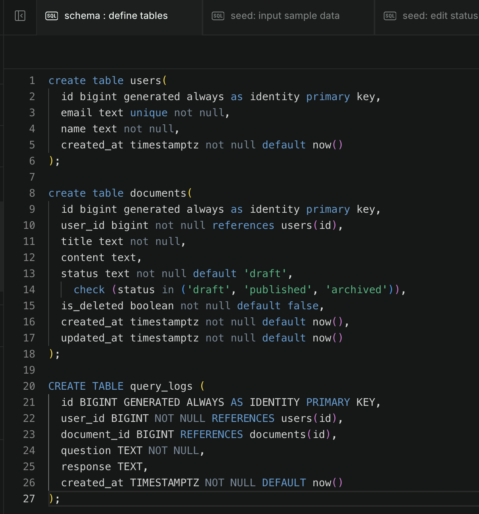
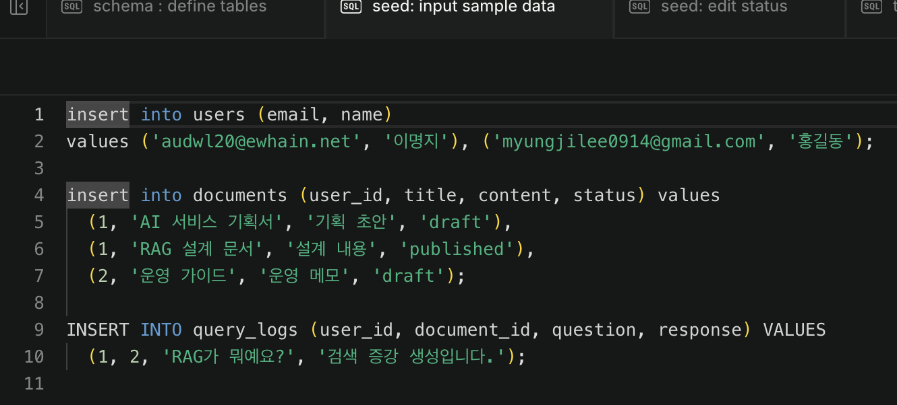
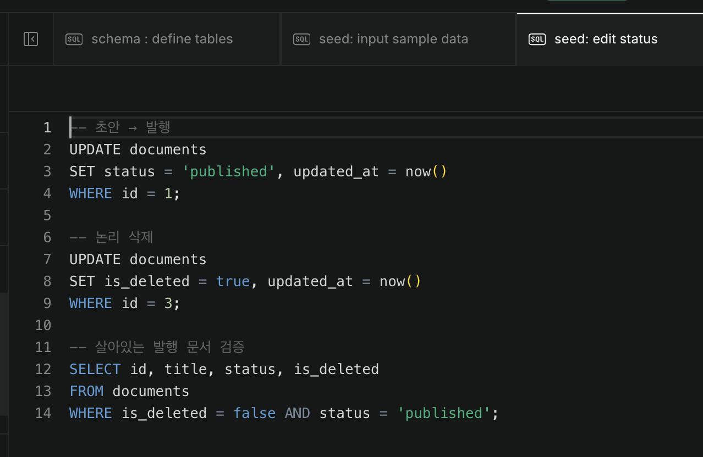
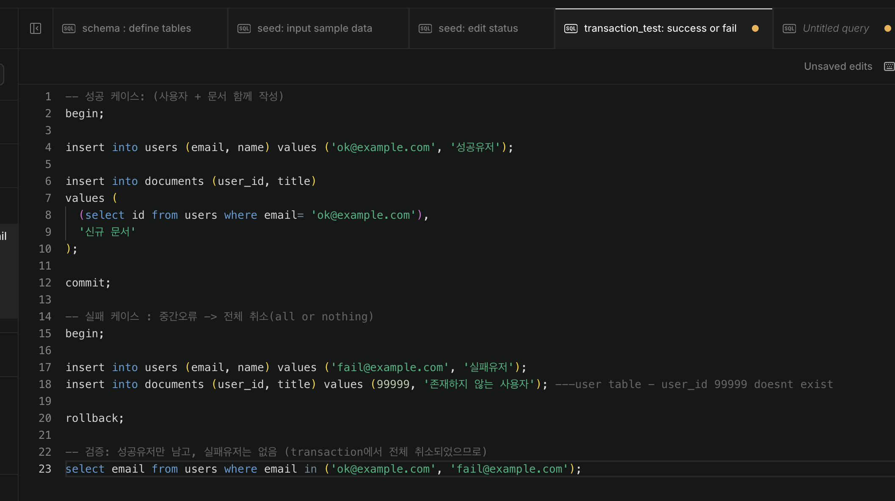
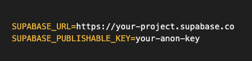

# 트랜잭션
---
[트랜잭션]
ex) 
- 은행 어플 a계좌에서 b계좌로 송금
- a 계좌 돈 빠져나감 처리
- b 계좌 돈 입금됨 처리
- 동시에 이루어져야 함, 둘 중 하나만 처리되면 오류
- 이를 한거번에 처리해주는 것이 transaction
- "전부 성공 아니면 취소" all or nothing
- 더 이상 조개질 수 없는 하나의 작업 단위

---

[TCL(Transcation Control Language)]
- transaction을 제어하는 명령어

```
BEGIN: (트랜잭션 시작)
...
...
...dml sqls
COMMIT: (그동안의 변경 영구 확정)

ROLLBACK: (commit 이전 변경 모두 취소, BEGIN 이전으로 되돌림)
```
- commit 하기 전 변경은 확정 x
- 연결이 끊기거나 ROLLBACK시 전부 사라짐
- 변경 저장 -> COMMIT
- 잘못된 저장 되돌리기 -> ROLLBACK

---

[트랜잭션 4가지 원칙]
A: Atomicity 원자성 = All or Nothing
C: Consistency 일관성 = 규칙(제약조건)을 위반하지 않음
I: Isolation 격리성 = 동시 트랜잭션이 서로 간섭하지 않음(동시성 문제) ex) 은행, 예약
D: Durability 지속성 = COMMIT -> DB에 영구 반영

---
SQL
- `schema`, `seed`, `transaction_test`로 나누어 관리
- schema: DDL(define table)
- seed: DML(edit data)
- transaction_test: check success / fail status
- examples below:
- schema:
- 
- seed:
- 
- 
- transaction_test:
- 
---
# supabase
- PostgreSQL을 클라우드에서 편하게 쓸 수 있도록 감싸 놓은 서비스 플랫폼

---
SDK(Software Development Kit)
- 함수로 부르기만 하면 내부에서 REST API요청 알아서 해줌
- 예) `supabase.table("documents").select()`
- supabase document에서 SDK 문법 조회 가능 (https://supabase.com/docs)

- **superbase client 초기화 설정**

```
# .env 파일의 값을 환경변수로 불러오기
import os
from dotenv import load_dotenv
from supabase import create_client, Client

# .env 파일의 값을 환경변수로 불러오기
load_dotenv()

url = os.getenv('SUPABASE_URL')
key = os.getenv('SUPABASE_PUBLISHABLE_KEY')

# Client 초기화
supabase = create_client(url, key)
print(supabase)

```
- insert 구조
```
# user 추가
response = (
    supabase.table("users")
    .insert(
        {
            "email": "user03@test.org"
        }
    )
    .execute()
)

```
- .select
```
response = (
    supabase.table("users")
    .select("*")
    .ilike("email", "USER%")
    .limit(1) # limit the num of rows returned
    .offset(1) # 1번 인덱스부터 조회
    .maybe_single() # 0~1개. 조회된 결과 없어도 오류 안남. 1개 있으면 1개 반환, 0개면 None 반환
    .execute()
)

print(response)
```
- left join
```
# LEFT JOIN
response = (
    supabase.table("documents")
    .select("id, title, content, users(id, email)")
    .execute()
)
response.data
```
- inner join
```
# INNER JOIN
response = (
    supabase.table("documents")
    .select("id, title, content, users!inner(id, email)")
    .ilike("users.email", "user%")
    .execute()
)
response.data
```
- update
```
response = (
    supabase.table("documents")
    .update({
        "title": "첫 번째 문서(수정)"
    })
    .eq("id", "7c2ccf7c-54fd-4c25-941d-c4402078efa0") # WHERE 과 같은 역할
    .execute()
)
```
- delete
```
respose = (
    supabase.table("users")
    .delete()
    .eq("id", "c73ce98c-da11-4c73-82bc-17df6af13081")
    .execute()
)
response.data
```
---
supabase authentication
- 회원가입
```
key = os.getenv("SUPABASE_ANON_KEY")
print(key)

supabase = create_client(url, key)
print(supabase)

"""
supabase.auth : 인증(로그인) / 인가(접근 제한) 관련 메서드 가지고 있는 객체

테이블명: auth.users
"""

# 회원가입
response = (
supabase.auth.sign_up({
    "email": "user01@test.org",
    "password": "password1234",
    "phone": "010-1000-1000"
})
)
```
- 로그인
```
# 로그인
response = supabase.auth.sign_in_with_password({
    "email":"user01@test.org",
    "password":"password1234"
})
response.user 
# 식별된 정보 유지
```
- 로그인 사용자 확인
```
# 현재 로그인된 사용자 확인
user = supabase.auth.get_user() # 현재 로그인한 사용자 정보, 있으면 로그인 상태, none이면 미인증상태

if user:
    print("로그인 상태:",user)
else:
    print("미로그인 상태")
```
- 로그아웃
```
# 로그아웃
supabase.auth.sign_out()
```

---
Keys
- Publishable key: 공개용, 제한된 권한
- service role key: 관리자용, 모든 권한, 외부 노출 금지, 서버 내부에서만 사용
- service role key 노출시 누구나 전체 데이터 조작 권한 가질 수 있음
- [publishable key + RLS(행 수준 보안)] 설정 한 세트로 기억
  
---
환경변수

- 환경변수 -> .env 에 저장
- .gitignore 파일 안 .env 저장
---
## LCEL 파이프라인 실습

```
from langchain_ollama import ChatOllama
from langchain_core.prompts import ChatPromptTemplate

# 시스템 메시지, SystemMessage(...): 역할, 상황, 제한 조건, 예시 
# user, HumanMessage(...): 사용자의 정의
# assistant, AIMessage(...): AI의 답변

prompt_template = ChatPromptTemplate.from_messages([
    ("system", "당신은 컴퓨터 기초 개념을 일상적인 사물에 빗대어 설명하는 교육 전문가입니다. 2문장 이내로 친절하게 설명하세요."), # system message 입력
    ("user", "{user_question}") # user_question은 user가 넣는 값에 따라 달라지므로, "{변수}"로 치환
])

sample_prompt = prompt_template.invoke({
    "user_question": "프로그래밍에서 '변수'가 무엇인가요?"
})

model = ChatOllama(
    model="mistral",
    base_url="http://localhost:11434" # Ollama server address
)

response = model.invoke(sample_prompt)

```

```
from langchain_core.output_parsers import StrOutputParser

parser = StrOutputParser()

text = parser.invoke(response)

# LCEL Pipe 연산자로 완전한 체인 결합 및 실행
chain = prompt_template | model | parser

chain.invoke({
    "user_question": "프로그래밍 언어에서 클래스(Class)에 대해 알기 쉬운 비유를 통해 설명해줘" # 치환되는 부분 설정
})

```
---