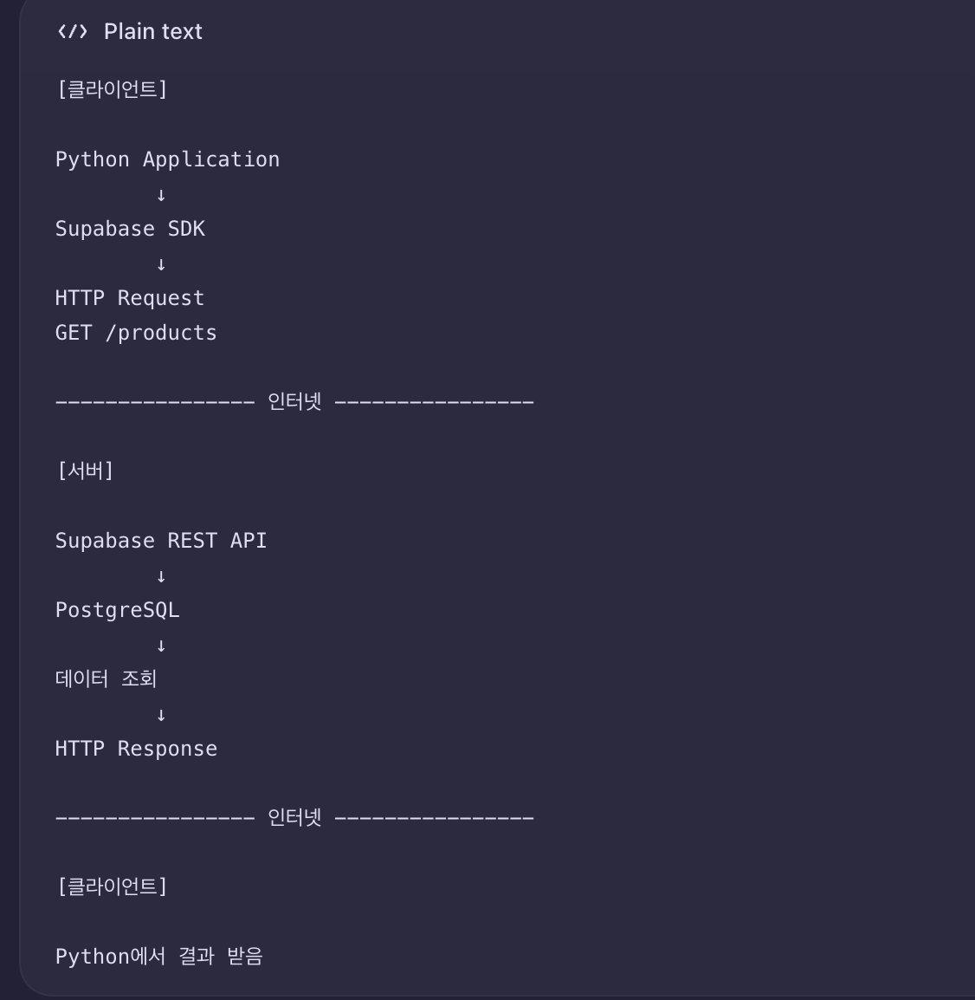
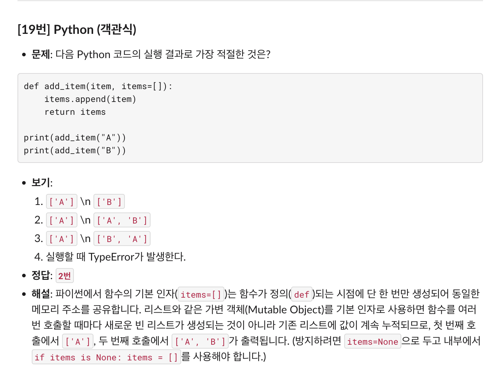

260911 TIL
---

#### API
API란?
- client -> API -> Server
- 클라이언트와 서버가 서로 요청과 응답을 주고받는 terminal 
- REST API: API 만드는 규칙 <표현적 상태 전이>
  - **자원**: 다루고 싶은 대상, ex) 데이터베이스 테이블
  - **전이**
- Supabase REST API 역할

---
#### Python type hint

---
#### Stored program
- for atomicity, bind multiple queries in a module
- using `plpgsql`
- 
1. Function / Supabase RPC
   - data snapshot 
2. Procedure
---
#### 빌더 패턴/생성 패턴

---
#### static var vs. dynamic var
- `static var`
  - kept in memory until a program ends
- `dynamic var`
  - inside HEAP
  - deleted after used
  - 

---
#### [IS NULL vs. = null]
- Never use `= null`: it will give you nothing
- `IS NULL`: return the row where the null is
  
---

---

---

---

#### github blog study session

---
[reflection or to-do list?]
- programmars coding test a day
- 