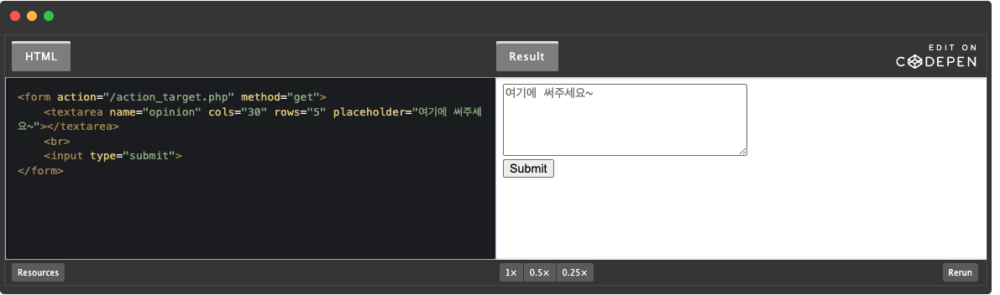
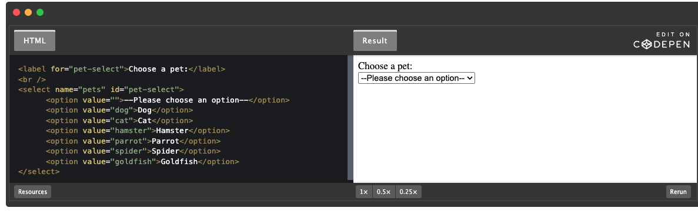
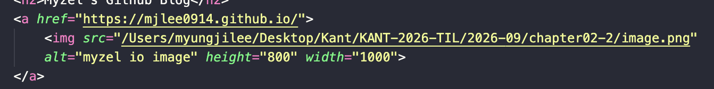

HTML (HyperText Markup Language)
- structure: HTML
- styling: CSS(Cascadaing Style Sheet)
  - cascading -> 상위 요소 스타일이 하위 요소에 전달
- dynamic element: JavaScript
- filename extension: `html` `htm`
- web standard: 어떤 브라우저를 사용해도 동일 화면, 동일 기능

---
[html 4개 구성 요소]
```html
<!DOCTYPE HTML> : "HTML5 버전으로 현재 문서가 작성됨."
<html> : 문서 시작 알림
    <head> : 문서 정보/문서 자원(CSS/JS)에 대한 정의
    </head>
    <body> : 문서에서 출력되는 부분
    </body>
</html> : 문서 종료 알림
```
----

- 제목 태그
  - `<h1>`~ `<h6>`
- 본문 서식 태그
  - `<p>...</p>` : paragraph
  - `<b>...</b>` : bold
    - `<strong>...</strong>`
  - `<i>...</i>` : italic
  - `<u>...</u>` : underline
  - `<del>...</del>` : strikeout
    - `<strike>...</strike>`
  - `<br>` : breaking line
  - `<hr>` : horizontal line
- 주석
  - `<!-- 설명 or 출력 배제할 코드 -->`
- 문단 태그 (Block)
- 글 태그 (Inline)

---

[HTML Form Tag & Attribute 정리]

Form이란?

`<form>`은 사용자가 입력한 데이터를 수집하고 서버로 전송하기 위한 영역이다.

예:
- 로그인
- 회원가입
- 검색
- 주문 정보 입력
- 설문조사
- 파일 업로드

기본 구조:

```html
    <body>
        <h1>Login/SignUp</h1>
        <hr>
        <form name="login and signup" action="#" method="get">
            ID: <input type="text" name="ID"><br>
            PASSWORD: <input type="password" name="password"><br>
            <input type="submit" value="login">
        </form>
    </body>
```
| Attribute | 설명 |
|---|---|
| `action` | 데이터를 전송할 주소 |
| `method` | `GET`, `POST` 등 전송 방식 |
| `enctype` | 데이터 인코딩 방식 |
| `autocomplete` | 자동완성 설정 |
| `novalidate` | 기본 유효성 검사 비활성화 |

---

#### `<input>`

사용자의 데이터를 입력받는 태그.

```html
<input type="text" name="username">
```

주요 Attribute:

| Attribute | 설명 |
|---|---|
| `type` | input 종류 |
| `name` | 서버로 전달할 데이터 이름 |
| `value` | 실제 값 |
| `placeholder` | 입력 힌트 |
| `required` | 필수 입력 |
| `readonly` | 읽기 전용 |
| `disabled` | 비활성화 |
| `checked` | 기본 선택 |
| `min`, `max` | 최소·최대값 |
| `maxlength` | 최대 글자 수 |

---

#### `<input type="">`

| Type | 설명 |
|---|---|
| `text` | 일반 텍스트 |
| `password` | 비밀번호 |
| `email` | 이메일 |
| `tel` | 전화번호 |
| `url` | URL |
| `search` | 검색 |
| `number` | 숫자 |
| `range` | 범위 슬라이더 |
| `checkbox` | 여러 항목 선택 |
| `radio` | 하나만 선택 |
| `date` | 날짜 |
| `datetime-local` | 날짜 + 시간 |
| `time` | 시간 |
| `month` | 연도 + 월 |
| `week` | 연도 + 주 |
| `color` | 색상 |
| `file` | 파일 |
| `hidden` | 화면에 보이지 않는 값 |
| `submit` | 폼 제출 |
| `reset` | 입력값 초기화 |
| `button` | 일반 버튼 |

```html
<h3>button</h3>
<input type="button" value="Click me" onclick="alert('Hello world!')">
<hr>

<h3>checkbox</h3>
<input type="checkbox" name="fruit1" value="apple" checked> 사과<br>
<input type="checkbox" name="fruit2" value="grape"> 포도<br>
<input type="checkbox" name="fruit3" value="peach"> 복숭아<br>
<hr>

<h3>color</h3>
<input type="color" name="mycolor">
<hr>

<h3>date</h3>
<input type="date" name="birthday">
<hr>

<h3>datetime</h3>
<input type="datetime" name="birthdaytime">
<hr>

<h3>datetime-local</h3>
<input type="datetime-local" name="birthdaytime">
<hr>

<h3>email</h3>
<input type="email" name="useremail">
<hr>

<h3>file</h3>
<input type="file" name="myfile">
<hr>

<h3>hidden</h3>
<input type="hidden" name="country" value="Norway">
hidden filed는 사용자에 표시되지 않는다.
<hr>

<h3>image</h3>
<input type="image" src="img/img_submit.gif" alt="Submit" width="48" height="48">
<hr>

<h3>month</h3>
<input type="month" name="birthdaymonth">
<hr>

<h3>number</h3>
<input type="number" name="quantity" min="2" max="10" step="2" value="2">
<hr>

<h3>password</h3>
<input type="password" name="pwd">
<hr>

<h3>radio</h3>
<input type="radio" name="gender" value="male" checked> 남자<br>
<input type="radio" name="gender" value="female"> 여자<br>
<hr>

<h3>range</h3>
<input type="range" name="points" min="0" max="10" step="1" value="5">
<hr>

<h3>reset</h3>
<input type="reset">
<hr>

<h3>search</h3>
<input type="search" name="googlesearch">
<hr>

<h3>submit</h3>
<input type="submit" value="Submit">
<hr>

<h3>tel</h3>
<input type="tel" name="mytel">
<hr>

<h3>text</h3>
<input type="text" name="myname">
<hr>

<h3>time</h3>
<input type="time" name="mytime">
<hr>

<h3>url</h3>
<input type="url" name="myurl">
<hr>

<h3>week</h3>
<input type="week" name="week_year">
```

---

#### `<label>`

입력 요소의 설명을 표시한다.
레이블 태그 클릭하면 텍스트 컨트롤에 초점이 맞춰져 사용성이 높아짐.

```html
<label for="email">이메일</label>
<input type="email" id="email">
```

`label`의 `for`와 `input`의 `id`를 동일하게 연결한다.

```html
<form name="selectFruit">
  <!-- 체크박스를 눌러야 체크가 된다 -->
  <input type="checkbox" /> 바나나
  <br>
  <!-- 레이블이 있다면 텍스트 영역을 클릭해도 체크가 된다 -->
  <label>
    <input type="checkbox" /> 바나나
  </label>
</form>
출처: https://inpa.tistory.com/entry/HTML-📚-폼Form-태그-정리 [Inpa Dev 👨‍💻:티스토리]
```

---

#### `<textarea>`

여러 줄의 텍스트를 입력할 때 사용한다.

```html
<textarea
    name="review"
    rows="5"
    placeholder="리뷰를 입력하세요."
></textarea>
```

주요 Attribute:

- `name`
- `rows`
- `cols`
- `placeholder`
- `maxlength`
- `required`
  

---

#### `<select>` / `<option>`

드롭다운 목록을 만든다.

```html
<select name="language">
    <option value="python">Python</option>
    <option value="java">Java</

```


---
[Block vs. Inline]

줄개행을 하냐 안 하냐 차이가 중요

- **Block**: 줄개행 O, 하나의 큰 영역/묶음으로 사용
  - 기본적으로 한 줄 전체 너비를 차지
  - `width`, `height` 지정 가능
  - `<h1>` ~ `<h6>`
  - `<p>`
  - `<div>`
  - `<ul>`
  - `<li>`

- **Inline**: 줄개행 X, 문장 일부분을 꾸밀 때 사용
  - **내용(content)만큼의 공간만 차지**
  - 일반적으로 `width`, `height`를 직접 지정할 수 없음
  - `<span>`: apply style on a part of text
  - `<strong>`: bold
  - `<em>`: italic
  - `<a>`: hyperlink / page 이동
  - ``: inline 요소이지만 `width`, `height` 지정 가능
  - `<mark>`: apply yellow highlight
  - `<u>`: underline

---
`<div>` 특징

- `<div>` = **division**
- 여러 HTML 요소를 하나의 **영역 / 그룹**으로 묶는 **container**
- **Block 요소**
  - 기본적으로 새 줄에서 시작
  - 한 줄 전체 너비를 차지
- 여러 요소를 `<div>`로 감싸면 하나의 영역처럼 관리할 수 있음
- CSS를 사용해서 해당 영역에 스타일이나 레이아웃을 적용할 때 자주 사용
- `<div>` 자체에는 특별한 의미가 없고, **요소들을 묶는 용도**로 사용

```html
<div>
  <h2>Profile</h2>
  <p>AI Engineer를 공부하고 있습니다.</p>
  <a href="#">GitHub</a>
</div>
```

→ `<h2>`, `<p>`, `<a>`를 하나의 `Profile` 영역으로 묶음

```css
<style>
  div {
  background-color: lightgray;
  padding: 20px;
  } 
</style>
```

→ `<div>`로 감싼 전체 영역에 배경색과 여백을 한 번에 적용 가능

---
[`href` vs `src`]

`href`
- `href` = **Hypertext Reference**
- 다른 페이지나 파일을 **연결하거나 참조**할 때 사용
- 주로 `<a>`, `<link>` 태그에서 사용

```html
<a href="https://google.com">Google</a>
```

- 클릭하면 해당 주소로 이동

```html
<link rel="stylesheet" href="style.css">
```

- 외부 CSS 파일을 연결


`src`
- `src` = **Source**
- 외부 파일을 현재 HTML 문서 안으로 **불러올 때** 사용
- 주로 ``, `<script>` 태그에서 사용

```html

```

- `cat.jpg` 이미지를 현재 페이지에 불러옴

```html
<script src="script.js"></script>
```

- 외부 JavaScript 파일을 현재 페이지에 불러옴


`href` vs `src` 차이

| 속성 | 의미 | 역할 | 대표 태그 |
|---|---|---|---|
| `href` | Hypertext Reference | 다른 위치나 파일을 **연결 / 참조** | `<a>`, `<link>` |
| `src` | Source | 파일을 현재 페이지로 **불러옴** | ``, `<script>` |


- `href` → **어디로 연결할까?**
- `src` → **무엇을 가져올까?**

---
[이미지에 하이퍼링크 넣는 법]

```html
<a href="url">
    
</a>
```

---
### LLM
주요 한계 개념:
- Hallucination
- Knowledge Cutoff
- Non-determinism: 같은 질문, 다른 답변
- Bias

환각 방지 프롬프트 및 temparature 제어
- top-k: 가장 높은 확률의 k개만큼의 토큰 선택
- top-p: p 확률 이상의 토큰에서 선택
- temperature: 0에 가까울수록 정확한 답변, 1에 가까울수록 창의적인 답변
  - 0에 가깝게 설정시 '도구설정', '형식 고정'

---
실습 문제들
```python
from langchain_core.prompts import ChatPromptTemplate
from langchain_ollama import ChatOllama
from langchain.chat_models import init_chat_model
from langchain_core.output_parsers import StrOutputParser

prompt_template = ChatPromptTemplate([
    ("system", "당신은 학습 데이터를 벗어난 질문에 대해 솔직하게 모른다고 답변하는 안전한 정보 검증 인공지능입니다. 객관적 사실만 전달하고, 모르는 내용은 '확인할 수 없습니다'라고 명확히 답변하세요."),
    ("user", "{user_question}")
])

model = init_chat_model(
    model_provider="ollama",
    model="mistral",
    temperature=0
)

parser = StrOutputParser()

chain = prompt_template | model | parser

question = "1999년 조선시대에 발명된 스마트폰의 기능에 대해 설명해줘."

response = chain.invoke({"user_question": question})

response
```

---
```python
import  # 정규표현식 사용을 위한 모듈 re import

def mask_personal_information(text: str) -> str: 
# type hint. text:str (text 매개변수는 str이 들어올 것)
# -> str(이 함수는 str 반환할 예정)
    credit_pattern = re.compile(r'\d{4}-\d{4}-\d{4}-\d{4}')
    # 카드번호 (4자리 숫자 연속 4개) 형식 정규표현식 만들기
    # credit_pattern에 저장

    masked = credit_pattern.sub("[카드번호 보호]", text)
    # text안에서 credit_pattern과 일치하는 부분 찾기
    # 일치하는 부분 찾으면 [카드번호 보호]로 바꾸기
    # .sub(바꿀문자열, 대상문자열)
    return masked

user_input = "신용카드 번호는 1234-5678-9011-1234 입니다."
mask_personal_information(user_input)
```
---
```python
from langchain.chat_models import init_chat_model # 사용할 채팅 모델 초기화 함수
from langchain_core.output_parsers import StrOutputParser # 모델 응답을 str으로 바꿔줌
from langchain_core.messages import SystemMessage, HumanMessage, AIMessage, BaseMessage # langchain에서 사용하는 메시지 객체 import
from langchain_core.prompts import ChatPromptTemplate   

model = init_chat_model(
    model_provider="ollama",
    model="coolsoon/kanana-1.5-8b"
)

parser = StrOutputParser()


prompt_template = ChatPromptTemplate.from_messages([
    ("system", "당신은 친절한 여행 가이드입니다. 방문하는 도시의 대표 관광지 1곳을 추천해주세요."),
    ("user", "이번 주말에 {city}로 여행을 갑니다.")
])

chain = prompt_template | model | parser

response = chain.invoke({"city": "부산"})
response
```
---
```python
from langchain.chat_models import init_chat_model # 사용할 채팅 모델 초기화 함수
from langchain_core.output_parsers import StrOutputParser # 모델 응답을 str으로 바꿔줌
from langchain_core.messages import SystemMessage, HumanMessage, AIMessage, BaseMessage # langchain에서 사용하는 메시지 객체 import
from langchain_core.prompts import ChatPromptTemplate   

prompt_template = ChatPromptTemplate.from_messages([
    ("system", "당신은 엄격한 국어 교사입니다. 입력된 문장의 맞춤법을 수정하여 결과만 간결하게 출력하세요."),
    ("user", "다음 문장의 문법을 수정하세요:{text}")
])

model = init_chat_model(
    model_provider="ollama",
    model="coolsoon/kanana-1.5-8b"
)

parser = StrOutputParser()

chain = prompt_template | model | parser

response = chain.invoke({"text": "이렇게 하면 않되."})
response
```
---
```python
from langchain.chat_models import init_chat_model # 사용할 채팅 모델 초기화 함수
from langchain_core.output_parsers import StrOutputParser # 모델 응답을 str으로 바꿔줌
from langchain_core.messages import SystemMessage, HumanMessage, AIMessage, BaseMessage # langchain에서 사용하는 메시지 객체 import
from langchain_core.prompts import ChatPromptTemplate   

model = init_chat_model(
    model_provider="ollama",
    model="coolsoon/kanana-1.5-8b"
)

parser = StrOutputParser()

chain = model | parser

messages: list[BaseMessage] = [
    SystemMessage("당신은 식당 점원입니다. 친절하게 답변하세요."),
    HumanMessage("여기서 가장 인기있는 메뉴가 무엇인가요?"),
    AIMessage("저희 식당의 최고 인기 멘는 치즈 돈까스입니다."),
    HumanMessage("그럼 그걸로 하나 주문할게요. 얼마나 걸리나요?")
]

response = chain.invoke(messages)
response
```