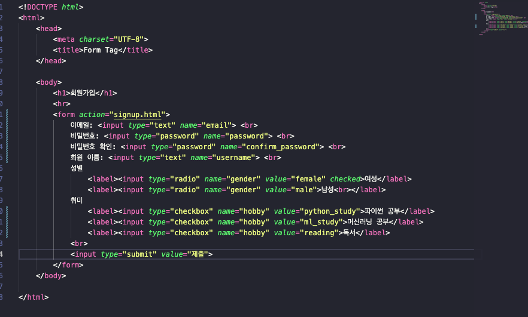

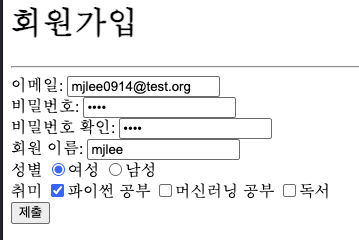
위 내용으로 입력한 후, 제출 버튼 누르면 
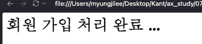
위 페이지로 이동.
위 페이지 주소는:

```
file:///Users/myungjilee/Desktop/Kant/ax_study/07_frontend_basic/chapter01/signup.html?email=mjlee0914%40test.org&password=1234&confirm_password=1234&username=mjlee&gender=female&hobby=python_study
```
입력하고 선택한 값이 주소에 그대로 할당됨.

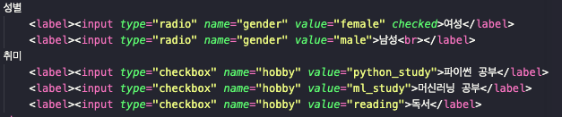
- `vaule=""`
- `method="GET"` default
  - `method="POST"` 로 변경시 주소 변경 (아래 주소 참고)
```
file:///Users/myungjilee/Desktop/Kant/ax_study/07_frontend_basic/chapter01/signup.html
```

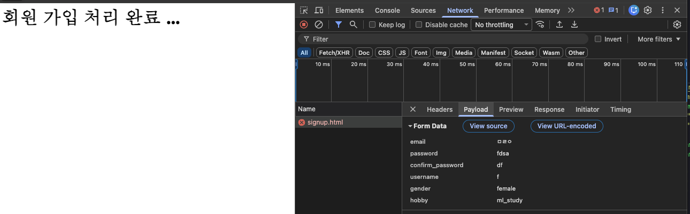
- signup.html page inspect -> network -> payload로 입력된 데이터 확인 가능
- ㅎ

---
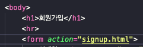
- `action="url"`: submit -> url

---
https://velog.io/@anhesu11/HTTP-%EA%B8%B0%EB%B3%B8-%EC%9D%B4%EB%A1%A0-%EC%A0%95%EB%A6%AC
https://www.geeksforgeeks.org/software-engineering/state-the-core-components-of-an-http-response/

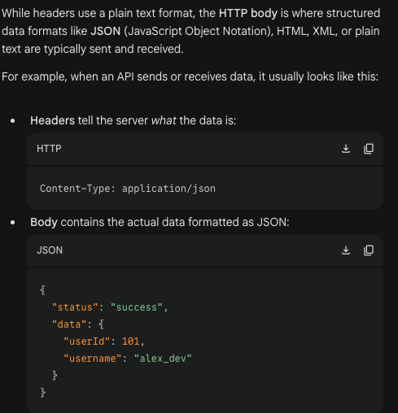

---

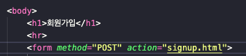
- `value` 지정시 input box에 자동으로 들어감
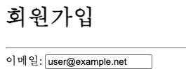

---
[태그, 입력 요소 연결방법]
- by `<label>`...`</label>`
- by `<label for="id val">` `id="val"`
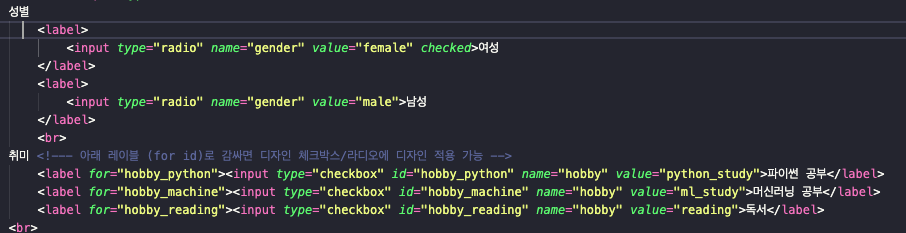

---

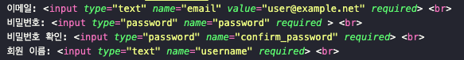
- required 적용시 아래
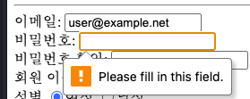

---

[textarea + placeholder 추가]
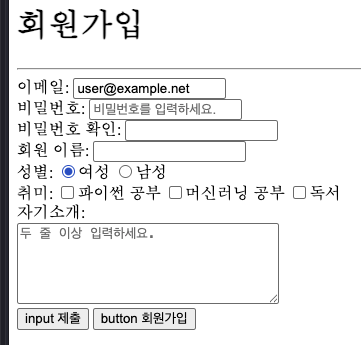
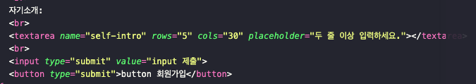


---
div vs. semantig tag?
- div inside semantig tag? or semantic tag inside div
- why more divs than semantic tags -- <main>

---
mockup style.css 만들어서 넣기
