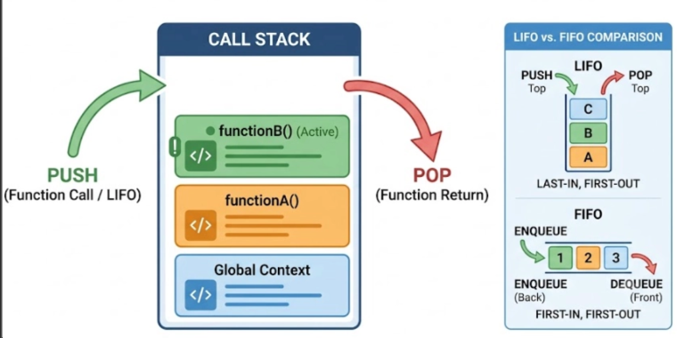
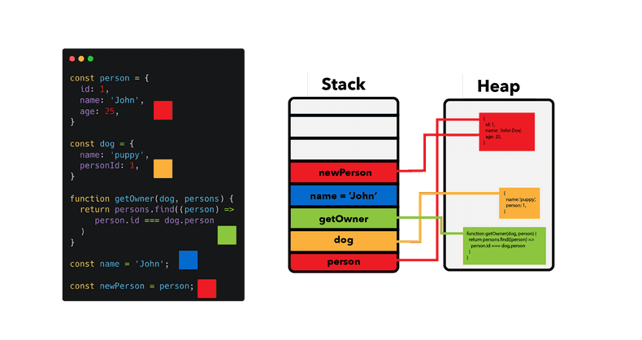
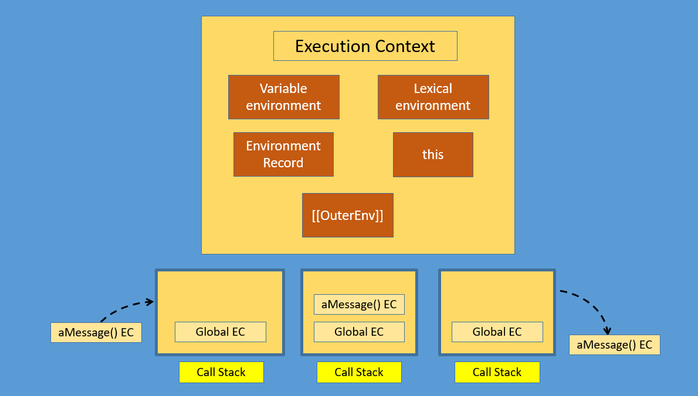
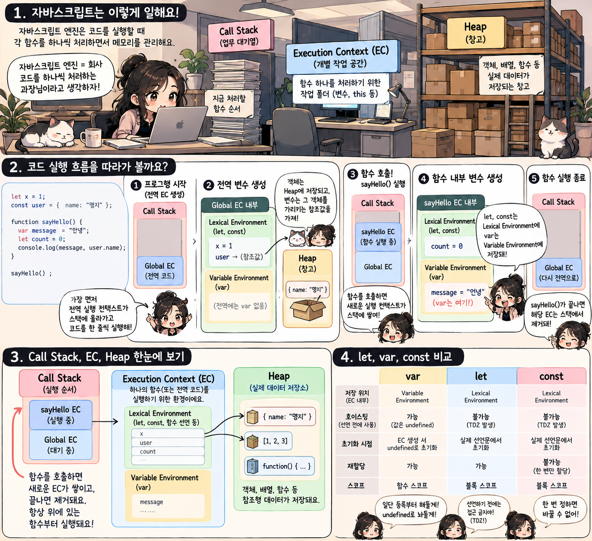
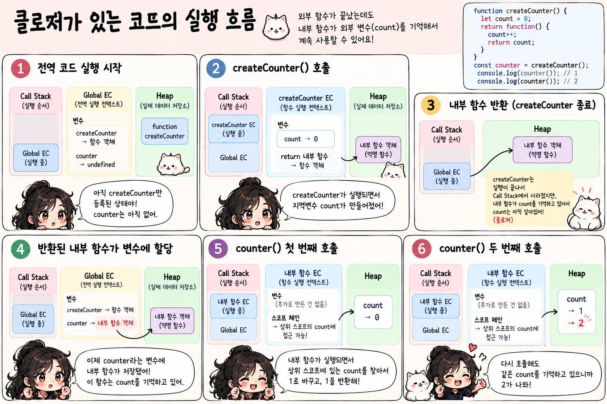

#### 일급 객체

```

1. a function can be passed as an argument
2. can be returned from a function
3. assigned to a variable
```

#### arrow function

```javascript
const varName = (parameters) => {
    return ...;
}

const varName2 = (parameters) => ...; // omit 'return' keyword

const varName3 = parameter => ...; //one paramter

const varName4 = () => ...; // no parameters

const varName5 = (...args) => {
    ...;
}

```
- arrow function -> no prototype object = new 연산자를 이용한 인스턴스 객체 생성불가

#### closure

자바스크립트 엔진 단계
1. 평가 단계: 코드 실행 전 준비
 - 코드 전체 구조 조회
   - 메모리 공간 매핑(호이스팅)
     - 변수 선언
     - 함수 식별자 정보
2. 실행 단계: 코드 실행
 - 첫 라인부터 연산 순차 실행
 - 변수 -> 실제 값 데이터 주입
 - 함수 정상 호출

JS Call Stack: LIFO
- 함수 호출 시 해당 함수 실행 정보는 스택 맨 윗부분에 쌓아 올려짐
- 엔진은 항상 맨 위에 쌓인 최신 함수 실행
- 함수 리턴시 스택 맨 위에서 해당 함수 정보 제거

```javascript
// 호출 스택의 변동 흐름 확인
function a() {
    console.log("the second one");
    b();
    console.log("the fourth one");
}

function b() {
    console.log("the third one");
}

console.log("console will start first");
console.log("this will be the last");
```


closure
- 원칙: 함수 종료시 call stack에서 pop, 함수 내부 local variable도 소멸
- but closure:
  - 외부 함수에서 반환된 내부 함수가 외부 함수에 있는 지역 변수를 참조한다면, 그 변수를 유지하기 위해 삭제하지 않고 메모리 보존
  - **내부 함수는 외부함수 local var의 집착광공**

```javascript
// closure example
function createCounter() {
    let count = 0; // 외부에서 직접 접근 불가

    return {
        getCount: function() {
            return count;
        },

        increase: function() {
            count++;
        }
        // getCount, increase 함수가 count를 기억 = closure
    };
}

const counter = createCounter();

console.log(counter.getCount()); // 0

counter.increase();

console.log(counter.getCount()); // 1

console.log(counter.count); // undefined
```

- 집착 광공 내부함수의 역할을 지피티가 쉬운 이해를 위해 그려준 이미지..


추가로 this에 대해서도...(오타쿠 아님)


---

- Heap space: 창고
- Stack: 원시값 저장 + 객체 데이터는 heap에서 끌어옴

EC 관점


```javascript
var x = 10; // global var

function test() {
    let y = 20; // local var

    const user = {
        name: "명지"
    };
}

test();
```

```
CALL STACK

┌──────────────────────────────┐
│ test EC                      │
│                              │
│ Lexical Environment          │
│   y = 20                     │
│   user ───────────────┐      │
├──────────────────────────────┤
│ Global EC                    │
│                              │
│ Variable Environment         │
│   x = 10                     │
└──────────────────────────────┘
                         │
                         ↓

HEAP

┌──────────────────────────────┐
│ Object                       │
│ { name: "명지" }            │
└──────────────────────────────┘
```





---