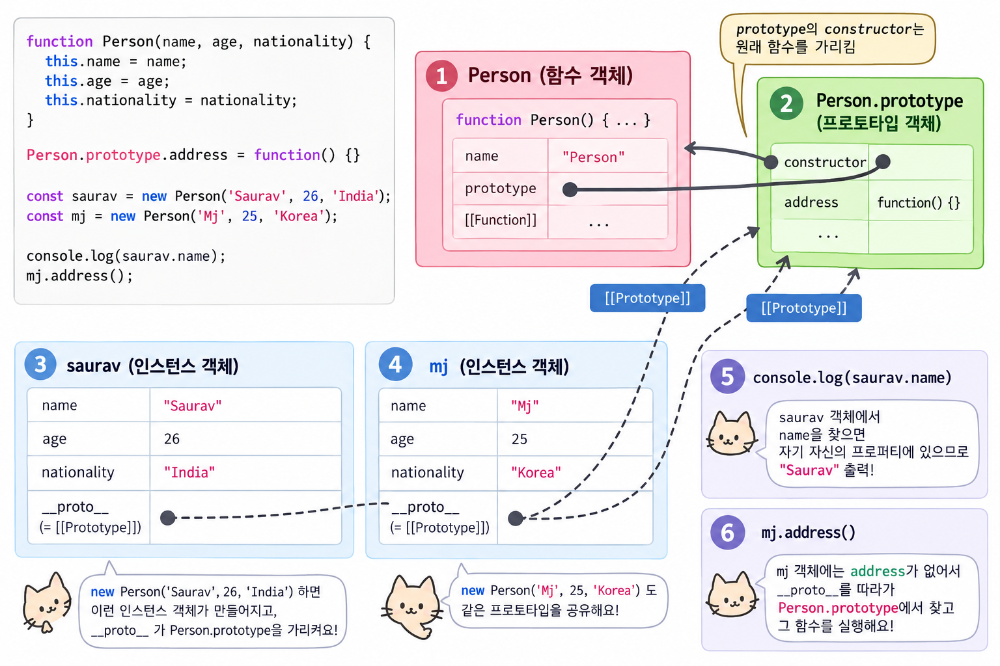

js에서 객체 만드는 법 (객체 = mold)
1. 객체 리터럴
   - obj = {}를 통한 객체 생성
2. 생성자 함수
```javascript
function Person(name, age) {
    this.name = name;
    this.age = age;
    this.method = function() {};
}
const saurav = new Person('saurav', 27); // new keyword를 이용하여 인스턴스 객체 생성
const mj = new Person('mj', 26);

console.log("this.method는 saurav와 mj 변수가 공유한다?", saurav.method === mj.method);
/// false. method는 인스턴스 객체마다 각각 새로 생성되므로 메모리 공간을 차지함.
```
3. `자식객체 = Object.create(부모객체)`
```javascript
const person = {
    describe() { return `name: ${this.name}, age: ${this.age}`}
}

const saruav = Object.create(person);
saurav.name = 'Saurav';
saurav.age = 26;
console.log("introducing Saurav:", person.describe());
```
---
프로토타입 객체를 사용한 공통 메서드 생성 및 적용 예시
- 인스턴스 객체가 공통 메서드를 공유할 수 있어 메모리 절약 가능
```javascript

function Person(name, age, nationality) {
    this.name = name;
    this.age = age;
    this.nationality = nationality;
}

Person.prototype.address = function() {}; // 공통 메서드를 생성자 함수 prototype에 등록하여 인스턴스 객체들이 공유할 수 있게 함 -> 메모리 절약

const saurav = new Person('Saurav', 26, 'India');
const mj = new Person('Mj', 25, 'Korea');

console.log(saurav.name);

mj.address();

```



---
프로토타입 -> 클래스 구문으로 변환 예시
- 클래스는 `new` keyword 없이 호출하면 TypeError
- 호이스팅 불가: 선언 이전 호출시 ReferenceError
```javascript
class Person {
    constructor(name, age, nationality) {
        this.name = name;
        this.age = age;
        this.nationality = nationality;
    }
    // 클래스 블록 내부에 선언된 메서드는 자동으로 Person.prototype.address로 등록됨
    address() {
        console.log("address!");
    }
}

const saurav = new Person("Saurav", 26, "India");
const mj = new Person("Mj", 25, "Korea");


console.log("mj와 saurav의 address는 일치한다.", saurav.address === mj.address);
```

---
property descriptor 
- 데이터 프로퍼티
    - 값
    - 쓰기 가능
    - 열거 가능
    - 재정의 가능
- 접근자 프로퍼티
  - 읽기
  - 쓰기
  - 열거 가능
  - 재정의 가능

`Object.getOwnPropertyDescriptor()`
    - object의 property 속성 설정 확인 가능
    - value
    - writable
    - enumerable
    - configurable

`Object.defineProperty()`
    - 새로운 프로퍼티 추가 및 기존 속성 수정 가능
    - writable: true = 프로퍼티 값 수정 가능
    - enumerable: true = loop에서 탐색 가능
    - configurable: true = 프토퍼티 삭제 및 속성설정 변경 가능

객체 수정 방지 잠금 메서드
  - `Object.preventExtensions()`: 추가만 불가
  - `Object.seal()`: 수정만 가능
  - `Object.freeze()`: 수정, 삭제, 추가 모두 불가

---
Data Serialization
- 객체 --> JSON format
- 파일 저장 / 네트워크 전송 가능
- `JSON.stringfy()`: object -> JSON string
- `JSON.parse()`: JSON string -> object
- 규칙 
  - key는 큰따옴표 `"property_name(key)"`
  - function, undefined -> 직렬화 제외
- `JSON.parse(JSON.stringfy())`로 깊은 복사
  - 복사본 내부 데이터 수정 시 원본 내부 데이터는 그대로 